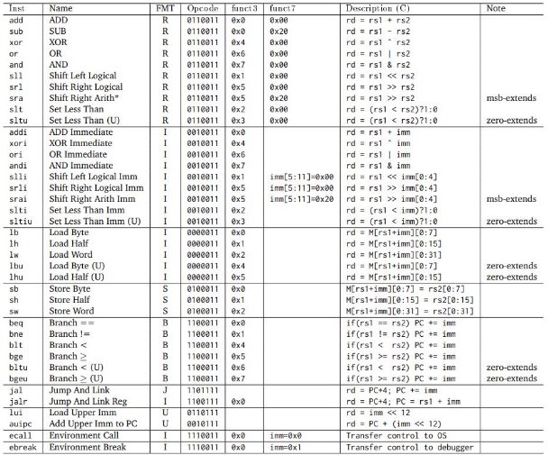
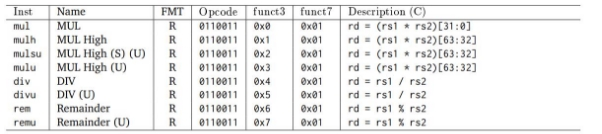
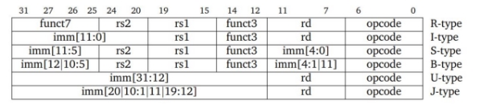
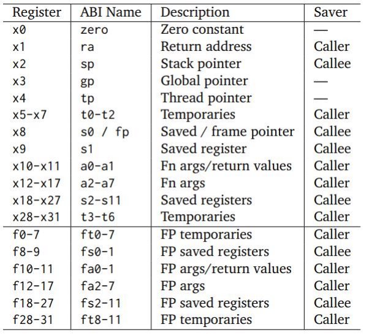

**Описание системы кодирования команд RISC-V** 

**ISA** - архитектура набора команд, определяющая системную реализацию работы процессора. 

**RISC-V** — реализация **ISA**, расширяемая открытая и свободная система команд  и  процессорная  архитектура  на  основе  концепции  **RISC**  для микропроцессоров и микроконтроллеров. В архитектуре **RISC-V** имеется обязательное для реализации небольшое подмножество команд и несколько стандартных опциональных расширений. 

**Базовые наборы** 

- RV32I — Базовый набор с целочисленными операциями, 32-битный 
- RV64I — Базовый набор с целочисленными операциями, 64-битный 
- RV32E  —  Базовый  набор  с  целочисленными  операциями  для встраиваемых систем, 32-битный 
- RV128I  —  Базовый  набор  с  целочисленными  операциями,  128-

  битный 

**Некоторые дополнительные расширения наборов** 

- ~M — Целочисленное умножение и деление 
- ~A — Атомарные операции (то есть операции, которые не могут быть выполнены частично; они либо выполняются, либо нет) 
- ~F — Арифметические операции с плавающей запятой над числами одинарной точности 
- ~D — Арифметические операции с плавающей запятой над числами 

  двойной точности 

- ~Q — Арифметические операции с плавающей запятой над числами четверной точности 
- ~L  —  Арифметические  операции  с  плавающей  запятой  над десятичными числами 
- ~C — Набор с сокращенными названиями команд 
- ~B — Битовые операции 
- ~J — Набор с эмуляцией набора команд с поддержкой динамической компиляцией во время запуска 
- ~P — SIMD-операции 
- ~V — Векторная обработка данных (параллельно для скорости) 

**Наборы RV32I и RV32M** 

RV32I — базовый набор для работы с 32-битными числами, включает 39 целочисленных инструкций. Эти инструкции делят на группы: *R*, *I*, *S*, *B*, *J*, *U*. У каждой группы свой отдельный идентификатор, записанный в виде нескольких  бит  в  конце  каждой  команды,  а  также  отдельная  структура описания инструкции. 

Выполняемая программа имеет доступ к 32 регистрам с разными именами, с которыми может выполнять необходимые задачи. 

Инструкции могут (Рис. 1): 

- Совершить  операцию  с  двумя  регистрами,  записать  результат  в третий; 
- Совершить операцию с регистром и константой, записать результат в регистр; 
- Загрузить часть регистра из памяти; 
- Записать часть регистра в память; 
- Перейти к заданной инструкции, если заданное условие выполняется; 
- Перейти к заданной инструкции; 
- Приостановить  выполнение  и  передать  контроль  операционной системе или отладчику. 



Рис.1: Все инструкции базового набора RV32I. 

RV32M  —  стандартное  расширение  к  базовому  набору  RV32I, добавляет функционал работы с умножением и делением. Даёт операции умножения, остатка, деления нацело (Рис. 2). 



Рис.2: Инструкции расширения RV32M. 

**Представление инструкций** 

В памяти все инструкции RV32I и RV32M представляются в виде 32 бит. То, как именно они представляются, зависит от их типа **FMT** и заданной этому типу структуре (см. Рис. 3) 



Рис.3: Структура инструкций 

В целом, почти все инструкции в **RISC-V** задаются в виде 32 бит, кроме расширения RV32C, который сокращает инструкции до 16 бит. 

Сама инструкция может быть определена по идентификатору группы **opcode** и значению **funct3** (в случае R-типа — дополнительно по значению **funct7**, так как количество инструкций в этой группе превышает лимит **funct3**). Всё задается в формате *little-endian*, то есть чтобы можно было прочитать инструкцию в формате слева направо как на табличке, четыре байта нужно повернуть в обратном порядке (**0X**232EF4FC -> **0X**FCF42E23). Поля  **rs1**  и  **rs2**  представляют  собой  регистры  (\*адреса  регистров)  над которыми  производятся  операции,  **rd  —**  регистр  для  записи  результата работы операции над **rs1** и **rs2**. Поле **imm** в зависимости от типа может представлять  собой  как  константу  для  совершения  с  ней  операции  над регистром,  так  и  значение, на  которое  должен  быть  совершен  переход, например в операциях типа *B* и *J.* 

Регистры, над которыми совершают операции имеют свои имена и предназначение (см. Рис. 4). Первые 16 идут в использование набору RV32I, остальные 16 предназначены для работы с нецелыми числами, например для  расширений  RV32F  или  RV32F,  поэтому  здесь  рассматриваться  не будут. 

Поле **imm** имеет такую странную структуру с разными частями в совершенно разных позициях инструкции по той причине, что на уровне аппаратной  реализации  эти  значения  извлекает  мультиплексор;  данная реализация помогает уменьшить количество раз, которое мультиплексор затрачивает  на  получение  значений,  уменьшая  коллизии  битов; соответственно  в  некоторых  случаях  можно  однозначно  определить некоторые биты, не прочитав их, по другим уже прочитанным битам. Это в итоге повышает общую производительность. 



Рис.4: имена регистров, их идентификаторы в полях **rs1**, **rs2** и **rd** 

**ELF файлы** 

*Эльфы, Старшие Дети этого мира, были племенем прекрасным и благородным; владыками их были Эльдар, ныне покинувшие эту землю, – Народ Великого Перехода, Народ Звёзд. (c) Властелин Колец* 

**ELF —** формат исполняемых двоичных файлов, используемый во многих современных UNIX-подобных операционных системах, таких как FreeBSD, Linux и Solaris. 

Обычно ELF делится на два типа — один для 32-разрядной архитектуры и второй, позже появившийся, для 64-битной. Здесь мы будем рассматривать 32-разрядную архитектуру. 

**Заголовок файла** 

В 32-битной реализации состоит из 52 байт, описывает самые важные поля, такие как начало выполняемого кода, начало полей с информацией и количество этой информации: 

- *e\_ident*  —  содержит  некоторую  информацию  по  файлу  и архитектуре. Первые четыре байта обязаны быть 0x7f, 0x45, 0x4c и 0x46, иначе нас обманули и это не ELF файл;* 
- *e\_type* — тип исполняемого файла;* 
- *e\_machine* — тип архитектуры, для реализации RISC-V будет 0xF3;* 
- *e\_version* — версия, на данный момент всегда 1;* 
- *e\_entry —* адрес, откуда начинается выполнение файла;* 
- *e\_phoff —* позиция таблицы заголовков программы (в данной работе  эта  таблица  не  нужна,  но  необходима  операционной системе для подготовки к запуску);* 
- *e\_shoff —* позиция таблицы заголовков секций; 
- *e\_flags  —*  связанные  с  файлом  флаги  для  использования 

  процессором;* 

- *e\_ehsize —* размер заголовка файла, для 32-битной реализации равен 52;* 
- *e\_phentsize —* размер одного заголовка программы;* 
- *e\_phnum —* число заголовков программы;* 
- *e\_shentsize —* размер одного заголовка секции;* 
- *e\_shnum —* число заголовков секции;* 
- *e\_shstrndx  —*  индекс  записи  в  таблице  заголовков  секций, описывающей таблицу названий секций. 

**Таблица заголовков секций** 

Таблица  заголовков  секций  содержит  атрибуты  секций  файла.  Секции передают  информацию,  либо  для  исполнения,  либо  для  использования другими  секциями.  Каждый  заголовок  секции  описывает  отдельную секцию: 

- *sh\_name* — указатель на имя секции в таблице названий секций, о ней будет сказано позже;* 
- *sh\_type* — тип секции;* 
- *sh\_flags* — атрибуты секции;* 
- *sh\_addr*  —  при  необходимости  предварительной  загрузки секции указывает адрес, куда её можно загрузить;* 
- *sh\_offset* — расположение секции относительно начала файла;* 
- *sh\_size* — размер секции в байтах;* 
- *sh\_link* — индекс ассоциированной секции;* 
- *sh\_info* — другая дополнительная информация;* 
- *sh\_addralign* — выравнивание секции;* 
- *sh\_entsize —* размер в байтах каждого элемента в секции.* 

**Секции** 

Секции описывают различные части файла, в итоге формируя исполняемый файл. Сфокусируемся на *.strtab*, *.symtab* и *.text*: 

- *.strtab* — содержит список строк, разделенных нулями. Эти строки являются именами секций и именами символов из секции *.symtab*, представленных в заданном ELF файле. Именно в этой секции другие секции указывают на своё имя полем *sh\_name.* 
- *.symtab* —   в  этой  секции  содержатся  все  символы,  которые компоновщик использует как во время компиляции, так и во время выполнения  приложения.  В  реализации  32-битного  ELF  файла содержит 16-байтные структуры, называемые символами и имеющие имя, значение, размер и другую информацию. Инструкции RISC-V в итоге используют эти символы для описания блока функции. 
- *.text*  —  сама  исполняемая  программа;  содержит  4-байтные  блоки инструкций,  в  данном  случае  инструкции  заданы  в  системе кодирования **RISC-V**.  

**Описание работы написанного кода** 

**Общее описание** 

Код был написан на Java с использованием JDK 19. 

Все важные части: инструкции, секции, символы, заголовки описаны своими  классами  и  при  создании  достают  по  заданному  адресу информацию о себе и записывают для дальнейшего использования. Также описан  общий  класс  Pair  для  удобства,  так  как,  к  сожалению,  язык  не поддерживает данную структуру в отличие от C++. 

Все описываемые файлы находятся на одном уровне с запускаемым файлом Main.java. 

Существует ещё один файл, Constants.java, содержащий необходимые переменные, константы, словари, к которым исполняемый код обращается по мере надобности. Тут же и описана функция extractBytes, которая читает информацию из файла в формате little-endian: 
```
public static long extractBytes(long offset, long byteNum) throws Exception { 

    if (byteNum <= 0 || byteNum > 4) { 

        throw new Exception("Wrong number of bytes to read in extractBytes()");     } 

    long result = 0; 

    for(long i = 0; i < byteNum; i++){ 

        if (offset + byteNum - i - 1 < 0 || offset + byteNum - i - 1 >= *TOTAL*) {             throw new Exception("Index out of boundaries when trying to read in extractBytes()"); 

        } 

        result = result \* 256 + (*bytes*[(int) (offset + byteNum - i - 1)]); 

    } 

    return result; 
} 
```
Эта  функция  используется,  например  в  классе  Header.java  для читания ELF файла: 
```
public Header() throws Exception { 

    e\_type = Constants.*extractBytes*(16, 2); 

    e\_machine = Constants.*extractBytes*(18, 2);     e\_version = Constants.*extractBytes*(20, 4);     e\_entry = Constants.*extractBytes*(24, 4); 

    e\_phoff = Constants.*extractBytes*(28, 4); 

    e\_shoff = Constants.*extractBytes*(32, 4); 

    e\_flags = Constants.*extractBytes*(36, 4); 

    e\_ehsize = Constants.*extractBytes*(40, 2); 

    e\_phentsize = Constants.*extractBytes*(42, 2);     e\_phnum = Constants.*extractBytes*(44, 2); 

    e\_shentsize = Constants.*extractBytes*(46, 2);     e\_shnum = Constants.*extractBytes*(48, 2); 

    e\_shstrndx = Constants.*extractBytes*(50, 2); 
} 
```
Ещё есть функция для преобразования беззнакового типа в знаковый, используется для преобразования поля **imm:** 
```
public static long immToSigned(long n, long where){     if ((n & (1L << (where - 1))) != 0) { 

        return (n | -(1L << where)); 

    } 

    else { 

        return n; 

    } 

} 
```
И функция которая помогает выделить необходимые биты из данных: 
```
public static long cutInstruction(long bin, long from, long to) {     bin = bin & ((1L << (from + 1)) - 1); 

    bin = bin & (-(1L << to)); 

    return (bin >> to); 

} 
```
Также  в  Constants.java  описаны  словари  для  каждого  **FMT**  типа, которые  по  полям  **funct3**  и  **funct7**  инструкции  RISC-V  однозначно определяют операцию. Например, для типа *S* словарь имеет следующий вид:  
```
public static final Map<Pair<Integer, Integer>, String> *FmtS* = Map.*ofEntries*(         *entry*(new Pair<>(0, 0), "sb"), 

        *entry*(new Pair<>(0x1, 0), "sh"), 

        *entry*(new Pair<>(0x2, 0), "sw") 

); 
```
**Парсинг** 

Берём аргументы командной строки, если мало — ошибка. Проверяем наличие файлов читки и записи, если кого-то не существует — ошибка. Далее читаем поток байтов в массив Constants.bytes, преобразуем из signed byte в положительный long. Даём классу Header прочитать свои 52 байта и выделить  поля,  проверяем  некоторые  из  них,  такие  как  первые  четыре **магических**  бита,  тип  архитектуры,  размер  заголовка,  если  что-то  не совпадает — ошибка. 

Далее, читаем все заголовки секций классами SectionHeader, ищем их настоящие имена в *.strtab*, который лежит по позиции найденного ранее поля e\_shstrndx из заголовка файла. Для удобства ложим каждую секцию в словарь по ключу имени из *.strtab* и значению самого класса секции. 

Далее, достанем из этого словаря секции  *.strtab* и *.symtab*. Теперь можно достать все символы классом Symbol из *.symtab* и соответствующие им имена из *.strtab*. Также добавим символы в словарь для дальнейшего использования инструкиями.  

Теперь  можно  достать  секцию  *.text*,  где  собственно  и  будет выполняться само дизассемблирование. Выделяя по четыре байта, передаем парсинг  классу  Instruction,  который,  используя  словари  **FMT**  типов, определяет  операции  и  читает  их  поля  соответствующе  своему  типу. Определив тип, он находит имена используемых регистров. Если вдруг это инструкция, подразумевающая переход (типа *B* или *J*), то необходимо ещё проверить наличие метки (символа из *.symtab*) в словаре (про который было сказано выше) по адресу с переходом. Если её нет, то добавим её в словарь по заданному правилу, после чего увеличим счётчик этих локальных меток. Добавим инструкцию в список чтобы в конце вывести их все. 

Для вывода сначала проходим по списку символов (не словарю с добавленными  дополнительно  локальными  метками,  а  именно изначальному списку из *.symtab*), выводим каждый по заданному шаблону. Далее берём список инструкций. Если вдруг адрес инструкции указывает на адрес  метки  в  словаре,  то  выводим  её.  Независимо  от  наличия  метки выводим саму инструкцию согласно её типу и заданному формату.  

В процессе всех действий в случае любой непонятной ситуации резко бросаем ошибку. 

**Компиляция и запуск** 
Компиляцию можно произвести командой ***javac Main.java*** 

Запуск командой ***java Main rv3 input\_file output\_file*** 

**Результат работы на заданном файле** 
```
.text
0001008c   <_start>:
   1008c:	00000793	   addi	a5, zero 0
   10090:	00078863	    beq	a5, zero 0x100a0 <L0>
   10094:	00010537	    lui	a0, 16
   10098:	48c50513	   addi	a0, a0 1164
   1009c:	3f40006f	    jal	zero, 0x10490 <L1>
000100a0   <L0>:
   100a0:	00008067	   jalr	zero, 0(ra)
   100a4:	00002197	  auipc	gp, 2
   100a8:	d5418193	   addi	gp, gp -684
   100ac:	c3418513	   addi	a0, gp -972
   100b0:	c5018613	   addi	a2, gp -944
   100b4:	40a60633	    sub	a2, a2, a0
   100b8:	00000593	   addi	a1, zero 0
   100bc:	1d8000ef	    jal	ra, 0x10294 <L2>
   100c0:	00000517	  auipc	a0, 0
   100c4:	3d050513	   addi	a0, a0 976
   100c8:	00050863	    beq	a0, zero 0x100d8 <__do_global_dtors_aux>
   100cc:	00000517	  auipc	a0, 0
   100d0:	3d850513	   addi	a0, a0 984
   100d4:	3bc000ef	    jal	ra, 0x10490 <L1>
000100d8   <__do_global_dtors_aux>:
   100d8:	120000ef	    jal	ra, 0x101f8 <L3>
   100dc:	00012503	     lw	a0, 0(sp)
   100e0:	00410593	   addi	a1, sp 4
   100e4:	00000613	   addi	a2, zero 0
   100e8:	074000ef	    jal	ra, 0x1015c <L4>
   100ec:	0dc0006f	    jal	zero, 0x101c8 <L5>
   100f0:	c341c703	    lbu	a4, -972(gp)
   100f4:	04071263	    bne	a4, zero 0x10138 <L6>
   100f8:	ff010113	   addi	sp, sp -16
   100fc:	00812423	     sw	s0 / fp, 8(sp)
   10100:	00078413	   addi	s0 / fp, a5 0
   10104:	00112623	     sw	ra, 12(sp)
   10108:	00000793	   addi	a5, zero 0
   1010c:	00078a63	    beq	a5, zero 0x10120 <L7>
   10110:	00011537	    lui	a0, 17
   10114:	5cc50513	   addi	a0, a0 1484
   10118:	00000097	  auipc	ra, 0
   1011c:	000000e7	   jalr	ra, 0(zero)
00010120   <L7>:
   10120:	00100793	   addi	a5, zero 1
00010124   <frame_dummy>:
   10124:	00c12083	     lw	ra, 12(sp)
   10128:	c2f18a23	     sb	a5, 23(gp)
   1012c:	00812403	     lw	s0 / fp, 8(sp)
   10130:	01010113	   addi	sp, sp 16
   10134:	00008067	   jalr	zero, 0(ra)
00010138   <L6>:
   10138:	00008067	   jalr	zero, 0(ra)
   1013c:	00000793	   addi	a5, zero 0
   10140:	00078c63	    beq	a5, zero 0x10158 <L8>
00010144   <main>:
   10144:	00011537	    lui	a0, 17
   10148:	c3818593	   addi	a1, gp -968
   1014c:	5cc50513	   addi	a0, a0 1484
   10150:	00000317	  auipc	t1, 0
   10154:	00000067	   jalr	zero, 0(zero)
00010158   <L8>:
   10158:	00008067	   jalr	zero, 0(ra)
0001015c   <L4>:
   1015c:	fe010113	   addi	sp, sp -32
   10160:	00812e23	     sw	s0 / fp, 28(sp)
   10164:	02010413	   addi	s0 / fp, sp 32
   10168:	00200793	   addi	a5, zero 2
   1016c:	fef42223	     sw	a5, 7(s0 / fp)
   10170:	00300793	   addi	a5, zero 3
   10174:	fef42023	     sw	a5, 3(s0 / fp)
   10178:	fe042623	     sw	zero, 15(s0 / fp)
   1017c:	fe042423	     sw	zero, 11(s0 / fp)
   10180:	0200006f	    jal	zero, 0x101a0 <L9>
00010184   <L10>:
   10184:	fec42703	     lw	a4, -20(s0 / fp)
   10188:	fe842783	     lw	a5, -24(s0 / fp)
   1018c:	00f707b3	    add	a5, a4, a5
   10190:	fef42623	     sw	a5, 15(s0 / fp)
   10194:	fe842783	     lw	a5, -24(s0 / fp)
   10198:	00178793	   addi	a5, a5 1
   1019c:	fef42423	     sw	a5, 11(s0 / fp)
000101a0   <L9>:
   101a0:	fe442703	     lw	a4, -28(s0 / fp)
   101a4:	fe042783	     lw	a5, -32(s0 / fp)
   101a8:	02f707b3	    mul	a5, a4, a5
   101ac:	fe842703	     lw	a4, -24(s0 / fp)
000101b0   <exit>:
   101b0:	fcf74ae3	    blt	a4, a5 0x10184 <L10>
   101b4:	00000793	   addi	a5, zero 0
   101b8:	00078513	   addi	a0, a5 0
   101bc:	01c12403	     lw	s0 / fp, 28(sp)
   101c0:	02010113	   addi	sp, sp 32
   101c4:	00008067	   jalr	zero, 0(ra)
000101c8   <L5>:
   101c8:	ff010113	   addi	sp, sp -16
   101cc:	00000593	   addi	a1, zero 0
   101d0:	00812423	     sw	s0 / fp, 8(sp)
   101d4:	00112623	     sw	ra, 12(sp)
   101d8:	00050413	   addi	s0 / fp, a0 0
   101dc:	194000ef	    jal	ra, 0x10370 <L11>
000101e0   <__libc_init_array>:
   101e0:	c281a503	     lw	a0, -984(gp)
   101e4:	03c52783	     lw	a5, 60(a0)
   101e8:	00078463	    beq	a5, zero 0x101f0 <L12>
   101ec:	000780e7	   jalr	ra, 0(a5)
000101f0   <L12>:
   101f0:	00040513	   addi	a0, s0 / fp 0
   101f4:	3a4000ef	    jal	ra, 0x10598 <L13>
000101f8   <L3>:
   101f8:	ff010113	   addi	sp, sp -16
   101fc:	00812423	     sw	s0 / fp, 8(sp)
   10200:	01212023	     sw	s2, 0(sp)
   10204:	00011437	    lui	s0 / fp, 17
   10208:	00011937	    lui	s2, 17
   1020c:	5d040793	   addi	a5, s0 / fp 1488
   10210:	5d090913	   addi	s2, s2 1488
   10214:	40f90933	    sub	s2, s2, a5
   10218:	00112623	     sw	ra, 12(sp)
   1021c:	00912223	     sw	s1, 4(sp)
   10220:	40295913	   srai	s2, s2 1026
   10224:	02090063	    beq	s2, zero 0x10244 <L14>
   10228:	5d040413	   addi	s0 / fp, s0 / fp 1488
   1022c:	00000493	   addi	s1, zero 0
00010230   <L15>:
   10230:	00042783	     lw	a5, 0(s0 / fp)
   10234:	00148493	   addi	s1, s1 1
   10238:	00440413	   addi	s0 / fp, s0 / fp 4
   1023c:	000780e7	   jalr	ra, 0(a5)
   10240:	fe9918e3	    bne	s2, s1 0x10230 <L15>
00010244   <L14>:
   10244:	00011437	    lui	s0 / fp, 17
   10248:	00011937	    lui	s2, 17
   1024c:	5d040793	   addi	a5, s0 / fp 1488
   10250:	5d890913	   addi	s2, s2 1496
   10254:	40f90933	    sub	s2, s2, a5
   10258:	40295913	   srai	s2, s2 1026
   1025c:	02090063	    beq	s2, zero 0x1027c <memset>
   10260:	5d040413	   addi	s0 / fp, s0 / fp 1488
   10264:	00000493	   addi	s1, zero 0
00010268   <L16>:
   10268:	00042783	     lw	a5, 0(s0 / fp)
   1026c:	00148493	   addi	s1, s1 1
   10270:	00440413	   addi	s0 / fp, s0 / fp 4
   10274:	000780e7	   jalr	ra, 0(a5)
   10278:	fe9918e3	    bne	s2, s1 0x10268 <L16>
0001027c   <memset>:
   1027c:	00c12083	     lw	ra, 12(sp)
   10280:	00812403	     lw	s0 / fp, 8(sp)
   10284:	00412483	     lw	s1, 4(sp)
   10288:	00012903	     lw	s2, 0(sp)
   1028c:	01010113	   addi	sp, sp 16
   10290:	00008067	   jalr	zero, 0(ra)
00010294   <L2>:
   10294:	00f00313	   addi	t1, zero 15
   10298:	00050713	   addi	a4, a0 0
   1029c:	02c37e63	   bgeu	t1, a2 0x102d8 <L17>
   102a0:	00f77793	      0	a5, a4 15
   102a4:	0a079063	    bne	a5, zero 0x10344 <L18>
000102a8   <L22>:
   102a8:	08059263	    bne	a1, zero 0x1032c <L19>
000102ac   <L21>:
   102ac:	ff067693	      0	a3, a2 -16
   102b0:	00f67613	      0	a2, a2 15
   102b4:	00e686b3	    add	a3, a3, a4
000102b8   <L20>:
   102b8:	00b72023	     sw	a1, 0(a4)
   102bc:	00b72223	     sw	a1, 4(a4)
   102c0:	00b72423	     sw	a1, 8(a4)
   102c4:	00b72623	     sw	a1, 12(a4)
   102c8:	01070713	   addi	a4, a4 16
   102cc:	fed766e3	   bltu	a4, a3 0x102b8 <L20>
   102d0:	00061463	    bne	a2, zero 0x102d8 <L17>
   102d4:	00008067	   jalr	zero, 0(ra)
000102d8   <L17>:
   102d8:	40c306b3	    sub	a3, t1, a2
   102dc:	00269693	   slli	a3, a3 2
   102e0:	00000297	  auipc	t0, 0
   102e4:	005686b3	    add	a3, a3, t0
   102e8:	00c68067	   jalr	zero, 12(a3)
   102ec:	00b70723	     sb	a1, 14(a4)
   102f0:	00b706a3	     sb	a1, 13(a4)
   102f4:	00b70623	     sb	a1, 12(a4)
   102f8:	00b705a3	     sb	a1, 11(a4)
   102fc:	00b70523	     sb	a1, 10(a4)
   10300:	00b704a3	     sb	a1, 9(a4)
   10304:	00b70423	     sb	a1, 8(a4)
   10308:	00b703a3	     sb	a1, 7(a4)
   1030c:	00b70323	     sb	a1, 6(a4)
   10310:	00b702a3	     sb	a1, 5(a4)
   10314:	00b70223	     sb	a1, 4(a4)
   10318:	00b701a3	     sb	a1, 3(a4)
   1031c:	00b70123	     sb	a1, 2(a4)
   10320:	00b700a3	     sb	a1, 1(a4)
   10324:	00b70023	     sb	a1, 0(a4)
   10328:	00008067	   jalr	zero, 0(ra)
0001032c   <L19>:
   1032c:	0ff5f593	      0	a1, a1 255
   10330:	00859693	   slli	a3, a1 8
   10334:	00d5e5b3	     or	a1, a1, a3
   10338:	01059693	   slli	a3, a1 16
   1033c:	00d5e5b3	     or	a1, a1, a3
   10340:	f6dff06f	    jal	zero, 0x102ac <L21>
00010344   <L18>:
   10344:	00279693	   slli	a3, a5 2
   10348:	00000297	  auipc	t0, 0
   1034c:	005686b3	    add	a3, a3, t0
   10350:	00008293	   addi	t0, ra 0
   10354:	fa0680e7	   jalr	ra, -96(a3)
00010358   <__call_exitprocs>:
   10358:	00028093	   addi	ra, t0 0
   1035c:	ff078793	   addi	a5, a5 -16
   10360:	40f70733	    sub	a4, a4, a5
   10364:	00f60633	    add	a2, a2, a5
   10368:	f6c378e3	   bgeu	t1, a2 0x102d8 <L17>
   1036c:	f3dff06f	    jal	zero, 0x102a8 <L22>
00010370   <L11>:
   10370:	fd010113	   addi	sp, sp -48
   10374:	01412c23	     sw	s4, 24(sp)
   10378:	c281aa03	     lw	s4, -984(gp)
   1037c:	03212023	     sw	s2, 0(sp)
   10380:	02112623	     sw	ra, 12(sp)
   10384:	148a2903	     lw	s2, 328(s4)
   10388:	02812423	     sw	s0 / fp, 8(sp)
   1038c:	02912223	     sw	s1, 4(sp)
   10390:	01312e23	     sw	s3, 28(sp)
   10394:	01512a23	     sw	s5, 20(sp)
   10398:	01612823	     sw	s6, 16(sp)
   1039c:	01712623	     sw	s7, 12(sp)
   103a0:	01812423	     sw	s8, 8(sp)
   103a4:	04090063	    beq	s2, zero 0x103e4 <L23>
   103a8:	00050b13	   addi	s6, a0 0
   103ac:	00058b93	   addi	s7, a1 0
   103b0:	00100a93	   addi	s5, zero 1
   103b4:	fff00993	   addi	s3, zero -1
000103b8   <L30>:
   103b8:	00492483	     lw	s1, 4(s2)
   103bc:	fff48413	   addi	s0 / fp, s1 -1
   103c0:	02044263	    blt	s0 / fp, zero 0x103e4 <L23>
   103c4:	00249493	   slli	s1, s1 2
   103c8:	009904b3	    add	s1, s2, s1
000103cc   <L25>:
   103cc:	040b8463	    beq	s7, zero 0x10414 <L24>
   103d0:	1044a783	     lw	a5, 260(s1)
   103d4:	05778063	    beq	a5, s7 0x10414 <L24>
000103d8   <L27>:
   103d8:	fff40413	   addi	s0 / fp, s0 / fp -1
   103dc:	ffc48493	   addi	s1, s1 -4
   103e0:	ff3416e3	    bne	s0 / fp, s3 0x103cc <L25>
000103e4   <L23>:
   103e4:	02c12083	     lw	ra, 44(sp)
   103e8:	02812403	     lw	s0 / fp, 40(sp)
   103ec:	02412483	     lw	s1, 36(sp)
   103f0:	02012903	     lw	s2, 32(sp)
   103f4:	01c12983	     lw	s3, 28(sp)
   103f8:	01812a03	     lw	s4, 24(sp)
   103fc:	01412a83	     lw	s5, 20(sp)
   10400:	01012b03	     lw	s6, 16(sp)
   10404:	00c12b83	     lw	s7, 12(sp)
   10408:	00812c03	     lw	s8, 8(sp)
   1040c:	03010113	   addi	sp, sp 48
   10410:	00008067	   jalr	zero, 0(ra)
00010414   <L24>:
   10414:	00492783	     lw	a5, 4(s2)
   10418:	0044a683	     lw	a3, 4(s1)
   1041c:	fff78793	   addi	a5, a5 -1
   10420:	04878e63	    beq	a5, s0 / fp 0x1047c <L26>
   10424:	0004a223	     sw	zero, 4(s1)
00010428   <L33>:
   10428:	fa0688e3	    beq	a3, zero 0x103d8 <L27>
   1042c:	18892783	     lw	a5, 392(s2)
   10430:	008a9733	    sli	a4, s5, s0 / fp
   10434:	00492c03	     lw	s8, 4(s2)
   10438:	00f777b3	    and	a5, a4, a5
   1043c:	02079263	    bne	a5, zero 0x10460 <L28>
   10440:	000680e7	   jalr	ra, 0(a3)
00010444   <L32>:
   10444:	00492703	     lw	a4, 4(s2)
   10448:	148a2783	     lw	a5, 328(s4)
   1044c:	01871463	    bne	a4, s8 0x10454 <L29>
   10450:	f92784e3	    beq	a5, s2 0x103d8 <L27>
00010454   <L29>:
   10454:	f80788e3	    beq	a5, zero 0x103e4 <L23>
   10458:	00078913	   addi	s2, a5 0
   1045c:	f5dff06f	    jal	zero, 0x103b8 <L30>
00010460   <L28>:
   10460:	18c92783	     lw	a5, 396(s2)
   10464:	0844a583	     lw	a1, 132(s1)
   10468:	00f77733	    and	a4, a4, a5
   1046c:	00071c63	    bne	a4, zero 0x10484 <L31>
   10470:	000b0513	   addi	a0, s6 0
   10474:	000680e7	   jalr	ra, 0(a3)
00010478   <atexit>:
   10478:	fcdff06f	    jal	zero, 0x10444 <L32>
0001047c   <L26>:
   1047c:	00892223	     sw	s0 / fp, 4(s2)
   10480:	fa9ff06f	    jal	zero, 0x10428 <L33>
00010484   <L31>:
   10484:	00058513	   addi	a0, a1 0
   10488:	000680e7	   jalr	ra, 0(a3)
0001048c   <__libc_fini_array>:
   1048c:	fb9ff06f	    jal	zero, 0x10444 <L32>
00010490   <L1>:
   10490:	00050593	   addi	a1, a0 0
   10494:	00000693	   addi	a3, zero 0
   10498:	00000613	   addi	a2, zero 0
   1049c:	00000513	   addi	a0, zero 0
   104a0:	0600006f	    jal	zero, 0x10500 <L34>
   104a4:	ff010113	   addi	sp, sp -16
   104a8:	00812423	     sw	s0 / fp, 8(sp)
   104ac:	000117b7	    lui	a5, 17
   104b0:	00011437	    lui	s0 / fp, 17
   104b4:	5d840413	   addi	s0 / fp, s0 / fp 1496
   104b8:	5dc78793	   addi	a5, a5 1500
   104bc:	408787b3	    sub	a5, a5, s0 / fp
   104c0:	00912223	     sw	s1, 4(sp)
   104c4:	00112623	     sw	ra, 12(sp)
   104c8:	4027d493	   srai	s1, a5 1026
   104cc:	02048063	    beq	s1, zero 0x104ec <L35>
   104d0:	ffc78793	   addi	a5, a5 -4
   104d4:	00878433	    add	s0 / fp, a5, s0 / fp
000104d8   <L36>:
   104d8:	00042783	     lw	a5, 0(s0 / fp)
   104dc:	fff48493	   addi	s1, s1 -1
   104e0:	ffc40413	   addi	s0 / fp, s0 / fp -4
   104e4:	000780e7	   jalr	ra, 0(a5)
000104e8   <__register_exitproc>:
   104e8:	fe0498e3	    bne	s1, zero 0x104d8 <L36>
000104ec   <L35>:
   104ec:	00c12083	     lw	ra, 12(sp)
   104f0:	00812403	     lw	s0 / fp, 8(sp)
   104f4:	00412483	     lw	s1, 4(sp)
   104f8:	01010113	   addi	sp, sp 16
   104fc:	00008067	   jalr	zero, 0(ra)
00010500   <L34>:
   10500:	c281a703	     lw	a4, -984(gp)
   10504:	14872783	     lw	a5, 328(a4)
   10508:	04078c63	    beq	a5, zero 0x10560 <L37>
0001050c   <L41>:
   1050c:	0047a703	     lw	a4, 4(a5)
   10510:	01f00813	   addi	a6, zero 31
   10514:	06e84e63	    blt	a6, a4 0x10590 <L38>
   10518:	00271813	   slli	a6, a4 2
   1051c:	02050663	    beq	a0, zero 0x10548 <L39>
   10520:	01078333	    add	t1, a5, a6
   10524:	08c32423	     sw	a2, 8(t1)
   10528:	1887a883	     lw	a7, 392(a5)
   1052c:	00100613	   addi	a2, zero 1
   10530:	00e61633	    sli	a2, a2, a4
   10534:	00c8e8b3	     or	a7, a7, a2
   10538:	1917a423	     sw	a7, 8(a5)
   1053c:	10d32423	     sw	a3, 8(t1)
   10540:	00200693	   addi	a3, zero 2
   10544:	02d50463	    beq	a0, a3 0x1056c <L40>
00010548   <L39>:
   10548:	00170713	   addi	a4, a4 1
   1054c:	00e7a223	     sw	a4, 4(a5)
   10550:	010787b3	    add	a5, a5, a6
   10554:	00b7a423	     sw	a1, 8(a5)
   10558:	00000513	   addi	a0, zero 0
   1055c:	00008067	   jalr	zero, 0(ra)
00010560   <L37>:
   10560:	14c70793	   addi	a5, a4 332
   10564:	14f72423	     sw	a5, 8(a4)
   10568:	fa5ff06f	    jal	zero, 0x1050c <L41>
0001056c   <L40>:
   1056c:	18c7a683	     lw	a3, 396(a5)
   10570:	00170713	   addi	a4, a4 1
   10574:	00e7a223	     sw	a4, 4(a5)
   10578:	00c6e633	     or	a2, a3, a2
   1057c:	18c7a623	     sw	a2, 12(a5)
00010580   <_exit>:
   10580:	010787b3	    add	a5, a5, a6
   10584:	00b7a423	     sw	a1, 8(a5)
   10588:	00000513	   addi	a0, zero 0
   1058c:	00008067	   jalr	zero, 0(ra)
00010590   <L38>:
   10590:	fff00513	   addi	a0, zero -1
   10594:	00008067	   jalr	zero, 0(ra)
00010598   <L13>:
   10598:	00000593	   addi	a1, zero 0
   1059c:	00000613	   addi	a2, zero 0
   105a0:	00000693	   addi	a3, zero 0
   105a4:	00000713	   addi	a4, zero 0
   105a8:	00000793	   addi	a5, zero 0
   105ac:	05d00893	   addi	a7, zero 93
   105b0:	00000073	  ecall
   105b4:	00054463	    blt	a0, zero 0x105bc <L42>
000105b8   <L43>:
   105b8:	0000006f	    jal	zero, 0x105b8 <L43>
000105bc   <L42>:
   105bc:	ff010113	   addi	sp, sp -16
   105c0:	00812423	     sw	s0 / fp, 8(sp)
000105c4   <__errno>:
   105c4:	00050413	   addi	s0 / fp, a0 0
   105c8:	00112623	     sw	ra, 12(sp)
   105cc:	40800433	    sub	s0 / fp, zero, s0 / fp
   105d0:	00c000ef	    jal	ra, 0x105dc <L44>
   105d4:	00852023	     sw	s0 / fp, 0(a0)
000105d8   <L45>:
   105d8:	0000006f	    jal	zero, 0x105d8 <L45>
000105dc   <L44>:
   105dc:	c301a503	     lw	a0, -976(gp)
   105e0:	00008067	   jalr	zero, 0(ra)

.symtab
Symbol Value          	Size Type 	Bind 	Vis   	Index Name
[   0] 0x0                   0 NOTYPE   LOCAL    DEFAULT   UNDEF 
[   1] 0x10074               0 SECTION  LOCAL    DEFAULT       1 
[   2] 0x115CC               0 SECTION  LOCAL    DEFAULT       2 
[   3] 0x115D0               0 SECTION  LOCAL    DEFAULT       3 
[   4] 0x115D8               0 SECTION  LOCAL    DEFAULT       4 
[   5] 0x115E0               0 SECTION  LOCAL    DEFAULT       5 
[   6] 0x11A08               0 SECTION  LOCAL    DEFAULT       6 
[   7] 0x11A14               0 SECTION  LOCAL    DEFAULT       7 
[   8] 0x0                   0 SECTION  LOCAL    DEFAULT       8 
[   9] 0x0                   0 SECTION  LOCAL    DEFAULT       9 
[  10] 0x0                   0 FILE     LOCAL    DEFAULT     ABS __call_atexit.c
[  11] 0x10074              24 FUNC     LOCAL    DEFAULT       1 register_fini
[  12] 0x0                   0 FILE     LOCAL    DEFAULT     ABS crtstuff.c
[  13] 0x115CC               0 OBJECT   LOCAL    DEFAULT       2 
[  14] 0x100D8               0 FUNC     LOCAL    DEFAULT       1 __do_global_dtors_aux
[  15] 0x11A14               1 OBJECT   LOCAL    DEFAULT       7 completed.1
[  16] 0x115D8               0 OBJECT   LOCAL    DEFAULT       4 __do_global_dtors_aux_fini_array_entry
[  17] 0x10124               0 FUNC     LOCAL    DEFAULT       1 frame_dummy
[  18] 0x11A18              24 OBJECT   LOCAL    DEFAULT       7 object.0
[  19] 0x115D4               0 OBJECT   LOCAL    DEFAULT       3 __frame_dummy_init_array_entry
[  20] 0x0                   0 FILE     LOCAL    DEFAULT     ABS test.c
[  21] 0x0                   0 FILE     LOCAL    DEFAULT     ABS exit.c
[  22] 0x0                   0 FILE     LOCAL    DEFAULT     ABS impure.c
[  23] 0x115E0            1064 OBJECT   LOCAL    DEFAULT       5 impure_data
[  24] 0x0                   0 FILE     LOCAL    DEFAULT     ABS init.c
[  25] 0x0                   0 FILE     LOCAL    DEFAULT     ABS atexit.c
[  26] 0x0                   0 FILE     LOCAL    DEFAULT     ABS fini.c
[  27] 0x0                   0 FILE     LOCAL    DEFAULT     ABS __atexit.c
[  28] 0x0                   0 FILE     LOCAL    DEFAULT     ABS sys_exit.c
[  29] 0x0                   0 FILE     LOCAL    DEFAULT     ABS errno.c
[  30] 0x0                   0 FILE     LOCAL    DEFAULT     ABS crtstuff.c
[  31] 0x115CC               0 OBJECT   LOCAL    DEFAULT       2 __FRAME_END__
[  32] 0x0                   0 FILE     LOCAL    DEFAULT     ABS 
[  33] 0x115DC               0 NOTYPE   LOCAL    DEFAULT       4 __fini_array_end
[  34] 0x115D8               0 NOTYPE   LOCAL    DEFAULT       4 __fini_array_start
[  35] 0x115D8               0 NOTYPE   LOCAL    DEFAULT       3 __init_array_end
[  36] 0x115D0               0 NOTYPE   LOCAL    DEFAULT       3 __preinit_array_end
[  37] 0x115D0               0 NOTYPE   LOCAL    DEFAULT       3 __init_array_start
[  38] 0x115D0               0 NOTYPE   LOCAL    DEFAULT       3 __preinit_array_start
[  39] 0x11DE0               0 NOTYPE   GLOBAL   DEFAULT     ABS __global_pointer$
[  40] 0x105C4               8 FUNC     GLOBAL   DEFAULT       1 __errno
[  41] 0x11A08               0 NOTYPE   GLOBAL   DEFAULT       6 __SDATA_BEGIN__
[  42] 0x11A0C               0 OBJECT   GLOBAL   HIDDEN        6 __dso_handle
[  43] 0x11A08               4 OBJECT   GLOBAL   DEFAULT       6 _global_impure_ptr
[  44] 0x101E0             156 FUNC     GLOBAL   DEFAULT       1 __libc_init_array
[  45] 0x1048C              92 FUNC     GLOBAL   DEFAULT       1 __libc_fini_array
[  46] 0x10358             288 FUNC     GLOBAL   DEFAULT       1 __call_exitprocs
[  47] 0x1008C              76 FUNC     GLOBAL   DEFAULT       1 _start
[  48] 0x104E8             152 FUNC     GLOBAL   DEFAULT       1 __register_exitproc
[  49] 0x11A30               0 NOTYPE   GLOBAL   DEFAULT       7 __BSS_END__
[  50] 0x11A14               0 NOTYPE   GLOBAL   DEFAULT       7 __bss_start
[  51] 0x1027C             220 FUNC     GLOBAL   DEFAULT       1 memset
[  52] 0x10144             108 FUNC     GLOBAL   DEFAULT       1 main
[  53] 0x10478              20 FUNC     GLOBAL   DEFAULT       1 atexit
[  54] 0x11A10               4 OBJECT   GLOBAL   DEFAULT       6 _impure_ptr
[  55] 0x115E0               0 NOTYPE   GLOBAL   DEFAULT       5 __DATA_BEGIN__
[  56] 0x11A14               0 NOTYPE   GLOBAL   DEFAULT       6 _edata
[  57] 0x11A30               0 NOTYPE   GLOBAL   DEFAULT       7 _end
[  58] 0x101B0              48 FUNC     GLOBAL   DEFAULT       1 exit
[  59] 0x10580              68 FUNC     GLOBAL   DEFAULT       1 _exit

```
**Список источников** 

[https://en.wikipedia.org/wiki/RISC-V ](https://en.wikipedia.org/wiki/RISC-V)

[https://blog.k3170makan.com/2018/10/introduction-to-elf-format-part-](https://blog.k3170makan.com/2018/10/introduction-to-elf-format-part-vi.html)

[vi.html ](https://blog.k3170makan.com/2018/10/introduction-to-elf-format-part-vi.html)

[https://github.com/jameslzhu/riscv-card/blob/master/riscv-card.pdf ](https://github.com/jameslzhu/riscv-card/blob/master/riscv-card.pdf)[https://refspecs.linuxbase.org/elf/gabi4+/ch4.symtab.html ](https://refspecs.linuxbase.org/elf/gabi4+/ch4.symtab.html)[https://en.wikipedia.org/wiki/Instruction_set_architecture ](https://en.wikipedia.org/wiki/Instruction_set_architecture)

[https://riscv.org/technical/specifications/ ](https://riscv.org/technical/specifications/)
